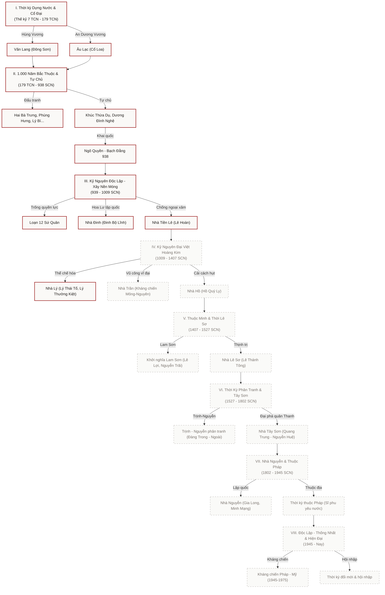

# Bản Phác Thảo Tổng Thể: Master Concept Map Lịch Sử Việt Nam

*Tài liệu nền tảng định hình toàn bộ lộ trình nội dung dự án `history-web` (Từ Cổ đại đến Hiện đại).*

---

## 🗺️ 1. Sơ Đồ Mermaid Tổng Thể Lịch Sử Việt Nam

---

## 📝 2. Chi Tiết Lộ Trình Phân Tích & Bài Học Từng Triều Đại

### Giai đoạn I: Thời kỳ Dựng Nước & Cổ Đại (Thế kỷ 7 TCN – 179 TCN)
* **Bối cảnh cốt lõi:** Quá trình định cư nông nghiệp trồng lúa nước sông Hồng và bước phát triển luyện kim đồng thau.
* **Bài học lịch sử:**
  * Sự thật khoa học (Khảo cổ Đông Sơn) luôn có sức nặng hơn huyền thoại vương quyền ảo tưởng.
  * *Bài học Âu Lạc:* Mất nước vì rò rỉ bí mật công nghệ quân sự (Nỏ thần) qua con đường tình cảm cá nhân.
* **Nhân vật biểu tượng:** Hùng Vương (Vương hiệu dòng họ), An Dương Vương.
* **Trạng thái:** `✅ Hoàn thành 100%`

### Giai đoạn II: 1.000 Năm Bắc Thuộc & Tự Chủ (179 TCN – 938 SCN)
* **Bối cảnh cốt lõi:** Thực dân phong kiến phương Bắc đô hộ và đồng hóa bằng sức mạnh quân sự và văn hóa.
* **Bài học lịch sử:**
  * Sức sống văn hóa nội tại được bảo tồn nhờ pháo đài tự trị Làng xã ("Phép vua thua lệ làng").
  * *Bài học Khởi nghĩa:* Ý chí căm thù (Nhân hòa) chỉ giúp thắng tạm thời; độc lập vĩnh viễn cần cả Thiên thời (phương Bắc loạn) và dựng thể chế cai trị riêng lập tức.
* **Nhân vật biểu tượng:** Hai Bà Trưng, Phùng Hưng, Khúc Thừa Dụ, Dương Đình Nghệ, Ngô Quyền.
* **Trạng thái:** `✅ Hoàn thành 100%`

### Giai đoạn III: Kỷ Nguyên Độc Lập - Xây Nền Móng (939 – 1009 SCN)
* **Bối cảnh cốt lõi:** Sự sụp đổ của nhà Ngô dẫn đến nội chiến cát cứ, sau đó là sự lập quốc của nhà Đinh và nhà Tiền Lê tại thung lũng Hoa Lư.
* **Bài học lịch sử:**
  * Tránh khoảng trống quyền lực tối cao để ngăn chặn thảm họa cát cứ chia rẽ.
  * Sách lược ngoại giao sinh tồn nước nhỏ: "Trả rẻ giữ đắt" (Chịu triều cống nhún nhường danh nghĩa để giữ tự trị thực chất).
* **Nhân vật biểu tượng:** Đinh Bộ Lĩnh, Dương Vân Nga, Lê Hoàn, Lê Long Đĩnh.
* **Trạng thái:** `✅ Hoàn thành 100%`

### Giai đoạn IV: Kỷ Nguyên Đại Việt Hoàng Kim (1009 – 1407 SCN)
* **Bối cảnh cốt lõi:** Nhà Lý dời đô về Thăng Long phát triển giao thương cởi mở, kết hợp văn hóa Phật giáo khoan hòa. Nhà Trần kế tục với võ công vĩ đại chống Mông-Nguyên.
* **Bài học lịch sử:**
  * Chuyển đổi phương thức cai trị từ "Uy vũ cá nhân" (Đinh - Lê) sang "Thể chế hóa" bằng luật pháp văn bản (Hình thư) và giáo dục quy trình (Văn Miếu).
  * Phòng thủ là nhất thời (Hoa Lư hiểm trở), phát triển cởi mở mới là vĩnh viễn (Thăng Long đồng bằng).
* **Nhân vật biểu tượng:** Thiền Sư Vạn Hạnh, Lý Công Uẩn, Lý Thánh Tông, Hoàng Hậu Ỷ Lan, Quách Quỳ (Nhà Tống), Lý Thường Kiệt, Trần Hưng Đạo, Hồ Quý Ly.
* **Trạng thái:** `🟡 Đang xây dựng` (Đã xong Lý Công Uẩn, Thiền Sư Vạn Hạnh, Lý Thánh Tông, Hoàng Hậu Ỷ Lan, Quách Quỳ).

### Giai đoạn V: Thuộc Minh & Thời Lê Sơ (1407 – 1527 SCN)
* **Bối cảnh cốt lõi:** Giặc Minh đô hộ tàn khốc, cuộc khởi nghĩa Lam Sơn kéo dài 10 năm gian khổ giành độc lập, mở ra triều đại Lê Sơ cực thịnh.
* **Bài học lịch sử:**
  * Sức mạnh kiên định chiến lược lâu dài (Nghị lực 5 sao của Lê Lợi).
  * Vai trò của tầng lớp trí thức chiến lược (Bình Ngô Đại Cáo của Nguyễn Trãi - thu phục nhân tâm).
* **Nhân vật biểu tượng:** Lê Lợi, Nguyễn Trãi, Lê Thánh Tông.
* **Trạng thái:** `⬜ Chờ tích hợp`

### Giai đoạn VI: Thời Kỳ Phân Tranh & Tây Sơn (1527 – 1802 SCN)
* **Bối cảnh cốt lõi:** Triều đình nhà Lê suy thoái, nhà Mạc cướp ngôi dẫn đến phân tranh Đàng Trong - Đàng Ngoài khốc liệt. Phong trào Tây Sơn bùng phát dẹp thù trong giặc ngoài thần tốc.
* **Bài học lịch sử:**
  * Sự phân rã của tập đoàn cai trị khi Tham-Sân-Si lấn át lợi ích dân tộc.
  * Tốc độ và sự quyết đoán vượt bậc trong hành động (Quang Trung Nguyễn Huệ).
* **Nhân vật biểu tượng:** Chúa Trịnh, Chúa Nguyễn, Quang Trung Nguyễn Huệ, Nguyễn Ánh.
* **Trạng thái:** `⬜ Chờ tích hợp`

### Giai đoạn VII: Nhà Nguyễn & Thuộc Pháp (1802 – 1945 SCN)
* **Bối cảnh cốt lõi:** Nhà Nguyễn thống nhất đất nước nhưng thực thi chính sách đóng cửa bảo thủ, dẫn đến bị Thực dân Pháp xâm lược và biến thành thuộc địa.
* **Bài học lịch sử:**
  * Sự trả giá tàn khốc của tư duy bảo thủ, đóng cửa từ chối cải cách thời thế.
  * Lòng yêu nước đơn thuần không thắng được sự vượt trội về công nghệ và thể chế hiện đại.
* **Nhân vật biểu tượng:** Gia Long, Minh Mạng, Phan Đình Phùng, Phan Bội Châu, Phan Châu Trinh.
* **Trạng thái:** `⬜ Chờ tích hợp`

### Giai đoạn VIII: Độc Lập - Thống Nhất & Hiện Đại (1945 – Nay)
* **Bối cảnh cốt lõi:** Cách mạng tháng Tám giành độc lập, chuỗi 30 năm kháng chiến chống Pháp - Mỹ trường kỳ, thống nhất đất nước 1975 và Đổi mới 1986.
* **Bài học lịch sử:**
  * Sức mạnh vô song của khối đại đoàn kết toàn dân và nghệ thuật ngoại giao cân bằng nước lớn.
  * Sự thức thời và tự soi rọi của thể chế để cải cách đổi mới kinh tế.
* **Nhân vật biểu tượng:** Hồ Chí Minh, Võ Nguyên Giáp.
* **Trạng thái:** `⬜ Chờ tích hợp`

---

## 🤝 3. Phương Thức Phối Hợp & Cập Nhật

Để đảm bảo bản đồ khái niệm luôn chính xác và sống động, chúng ta sẽ phối hợp theo mô hình sau:

1. **Anh giữ vai trò "Tổng Biên Tập & Kiến Trúc Sư Nội Dung":** 
   * Anh chỉnh sửa trực tiếp, thêm ý tưởng, chỉnh sửa các mối liên kết hoặc bổ sung các triều đại mới vào file [master-concept-map.md](file:///d:/01.%20Projects/history-web/docs/master-concept-map.md) này bất cứ lúc nào.
2. **Em giữ vai trò "Lập Trình Viên & Chuyên Gia Hiện Thực Hóa":**
   * Em sẽ đọc các cập nhật mới nhất từ file này, tự động vẽ lại sơ đồ Mermaid và **code nâng cấp trực tiếp giao diện tương tác** của trang [ban-do.html](file:///d:/01.%20Projects/history-web/ban-do.html) để người học lập tức có trải nghiệm trực quan.
